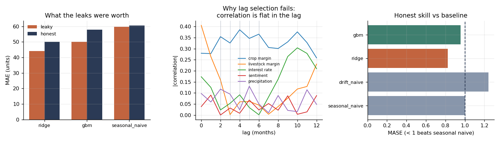
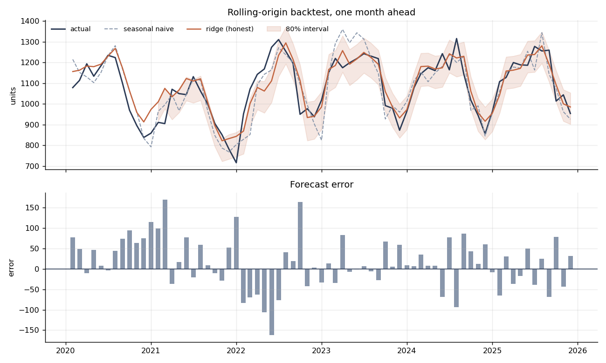

# Demand Forecasting with External Economic Signals

Monthly demand forecasting for a dealer-distributed durable good, where the customers'
economics — commodity margins, interest rates, sentiment, weather — drive purchases with
a lead time of several months.

The modelling is ordinary. What this repo is actually about is **the three ways a
forecasting backtest lies to you**, each one measured rather than asserted:

1. Feature-timing leakage inflates apparent accuracy by **12–14%**.
2. Automated lag selection performs **worse than a flat guess**.
3. Handing a linear model a variable whose true sign differs by customer segment
   produces coin-flip coefficients — fixable by construction, not by regularisation.

> **Data note.** Everything runs on a synthetic series generated by
> [`src/generate.py`](src/generate.py) — no proprietary or employer data. The generator
> is documented, seeded, and encodes the pathologies deliberately, with the true lead
> times hidden from the modelling code so lag recovery is a real problem.
> `python run_analysis.py` reproduces every number below.

---

## 1. What the leaks were worth

Identical models and backtest. The only difference is whether features respect what was
knowable at forecast time.

| Model | Leaky MAE | Honest MAE | Leaky MASE | Honest MASE | Accuracy overstated |
|---|---:|---:|---:|---:|---:|
| Ridge | 44.18 | 49.94 | 0.74 | 0.83 | **11.5%** |
| GBM | 50.02 | 57.84 | 0.84 | 0.96 | **13.5%** |
| Seasonal naive | 59.71 | 60.49 | 1.00 | 1.00 | 1.3% |

The baseline is unaffected — it uses no features, so it has nothing to leak. That is the
tell: **when a leak is present, only the feature-driven models improve**, and a model
that beats the baseline solely in the leaky pipeline has not learned anything.

The four leaks closed, all in [`src/leakage.py`](src/leakage.py) and
[`src/features.py`](src/features.py):

| Leak | Example | Guard |
|---|---|---|
| Contemporaneous internal aggregates | `unique_dealers`, `stock_on_lot` for the month being forecast | shift ≥ 1 period |
| Unlagged external drivers | `grain_price` for month M used to forecast month M | drop raw columns after lagging |
| Rolling window including today | `y.rolling(3).mean()` without `.shift(1)` | shift before every rolling call |
| Publication delay ignored | official statistics read a month before release | `apply_publication_delay()` |

A timing audit catches these automatically by comparing each feature's correlation with
`y(t)` against `y(t+1)`. A genuine leading indicator predicts the future; a leaked one
describes the present:

| Feature | corr with y(t) | corr with y(t+1) | Excess | Suspect |
|---|---:|---:|---:|:--:|
| `stock_on_lot` | −0.547 | −0.297 | 0.250 | ✅ |
| `precipitation` (unlagged) | 0.516 | 0.338 | 0.178 | ✅ |
| `unique_dealers` | 0.652 | 0.536 | 0.116 | ✅ |



---

## 2. Automated lag selection did not work

Each external driver acts with a true lead time (4–6 months) known only to the generator.
The obvious approach — scan lags 0–12 and keep the highest correlation — is standard
practice. Under an identical honest pipeline, changing only the lag map:

| Lag specification | Ridge MAE | Ridge MASE | GBM MASE |
|---|---:|---:|---:|
| Oracle (true lead times) | 45.30 | **0.749** | 0.898 |
| **Flat lag = 3, no selection** | 47.35 | **0.783** | 0.900 |
| Scan on full series (selection leak) | 48.44 | 0.801 | 0.945 |
| Scan on train window only | 49.94 | 0.826 | 0.956 |
| Flat lag = 1, no selection | 49.63 | 0.820 | 0.934 |

**The data-driven scan is beaten by guessing 3.** Knowing the true lags is worth a lot
(0.749 vs 0.826) — but that information cannot be recovered from correlations.

Why: the drivers are persistent (AR(1), φ ≈ 0.9–0.97), so a series barely differs from
itself one month earlier and the correlation profile is nearly flat in the lag. The
argmax is then dominated by noise. Only `crop_margin` — the constructed feature with the
sharpest profile — is recovered exactly:

| Driver | True lead | Scan (train-only) | Error |
|---|---:|---:|---:|
| `crop_margin` | 4 | **4** | 0 |
| `sentiment` | 2 | 1 | 1 |
| `precipitation` | 3 | 5 | 2 |
| `interest_rate` | 6 | 10 | 4 |
| `livestock_margin` | 5 | 0 | 5 |

The practical conclusion is not "lags don't matter" — the oracle row shows they matter a
great deal. It is that **lag choice should come from domain knowledge of the decision
cycle, not from a correlation scan**, and that a defensible flat lag beats a scan that
looks rigorous and is fitting noise.

Note the third row: scanning the full series *beats* scanning train-only (0.801 vs
0.826). That gap is the **selection leak** — no individual feature is mistimed, but the
choice of lags was informed by the test period. It is subtle, survives code review, and
inflates a backtest on its own.

---

## 3. The sign-flip problem, and fixing it by construction

Grain price enters the business through opposing channels: **revenue** for a crop grower,
**feed cost** for a livestock operation. Both buy the same equipment. Handed the raw
price, a linear model must choose one sign for a variable whose true effect has two —
and because grain and feed cost are collinear, the fitted sign is unstable.

Refitting on rolling 60-month windows and measuring how often each coefficient keeps its
sign:

| Specification | Feature | Sign consistency | Mean coefficient |
|---|---|---:|---:|
| Raw prices | `grain_price` | 0.55 | +7.98 |
| Raw prices | `livestock_price` | 0.61 | +14.81 |
| Raw prices | `feed_cost` | 0.52 | +4.71 |
| **Segment margins** | `crop_margin` | **0.87** | +30.35 |
| **Segment margins** | `livestock_margin` | **0.65** | +4.98 |

**0.56 → 0.76 mean sign consistency.** Raw `feed_cost` at 0.52 is a coin flip.

The fix is not regularisation. It is building the quantity that actually drives the
purchase — segment margin, revenue leg minus cost leg — so each feature is signed
correctly by construction, mirroring how published industry margin measures are defined:

```python
crop_margin      = 0.055 * (grain_price - 380)     - 0.020 * (feed_cost - 190)
livestock_margin = 0.30  * (livestock_price - 128) - 0.055 * (feed_cost - 190)
```

Both then carry the correct positive sign, and the coefficients become interpretable
enough to defend to someone who knows the business.

---

## 4. Honest skill, and metrics a planner can use



Against a seasonal-naive benchmark on a rolling-origin backtest, the honest ridge model
reaches **MASE 0.826** — a real but modest 17% improvement. Reported this way because the
leaky pipeline's 0.74 is not reproducible in deployment, and a seasonal baseline on
strongly seasonal monthly demand is genuinely hard to beat.

Point accuracy is not the decision, though. The planner's question is *"should we build
inventory next month?"* — a classification problem:

| Model | Precision | Recall | F1 |
|---|---:|---:|---:|
| Ridge | 0.64 | 0.60 | **0.62** |
| GBM | 0.73 | 0.53 | 0.62 |
| Seasonal naive | 0.56 | 0.67 | 0.61 |

The margin over the baseline here is thin — the models trade precision against recall
rather than dominating it. Worth stating plainly: on the decision that matters, this
model is only modestly better than repeating last year.

Prediction intervals come from the model's own expanding backtest residuals — no
distributional assumption, only errors it has already made:

```
80% empirical interval coverage (ridge): 0.729 on 59 scored origins
```

**This under-covers**, and the reason is visible in the residuals: their sd falls from
75.4 in the first half of the backtest to 46.6 in the second, as the training window
grows. Intervals built from pooled historical residuals inherit the early, larger errors
and are mis-scaled for the current regime. A weighted or rolling-window residual
quantile would calibrate better; the naive pooled version is left in place, and reported
as failing, because it is the version most people write first.

The same non-stationarity means a single headline accuracy number understates current
performance.

---

## A second pass: production plan, multi-horizon, and fixed intervals

[`notebooks/02_production_forecasting_plan.ipynb`](notebooks/02_production_forecasting_plan.ipynb)
closes the two limitations this README flags below, and sketches what running it monthly
would involve.

**The interval under-coverage was a bug, not a modelling limit.** Two errors: no
finite-sample conformal correction (the quantile is the `ceil((n+1)·coverage)`-th smallest
absolute residual, not the plain quantile), and warm-up origins were being scored. Fixed:

| | Coverage (nominal 0.80) |
|---|---:|
| Notebook 01, pooled quantile | 0.729 |
| Finite-sample conformal, flat band | **0.868** |
| Normalized (adaptive) conformal, BayesianRidge | **0.849** |

**Multi-horizon.** A recursive 6-month forecast, rebuilding every lag and rolling feature at
each step and feeding predictions back in. Bands are calibrated **per horizon** from
backtested h-step paths rather than reusing the one-step number — ±66 at h=1 widening to ±74
at h=6. Error grows only modestly here because seasonality dominates and calendar features
do not decay with horizon; on a momentum-driven series the curve would be far steeper. The
point is to measure that curve, not assume it.

**A third finding that did not go as designed.** Adaptive bands were supposed to be the
upgrade. They tracked error only weakly (r ≈ +0.12 vs −0.02 for flat) at essentially
identical mean width (180.7 vs 180.9). The gain is confined to calibration, and the notebook
says so rather than presenting the method as a win.

**Leaderboard**, all models on the same origins and the same benchmark:

| Model | MAE | MASE | Direction acc. |
|---|---:|---:|---:|
| ARD | 48.1 | **0.796** | 0.771 |
| BayesianRidge | 49.2 | 0.814 | 0.800 |
| Ridge | 49.9 | 0.826 | 0.800 |
| Gradient boosting | 57.8 | 0.956 | 0.743 |
| Seasonal naive | 60.5 | 1.000 | 0.786 |

The spread between serious models is narrow — a reason to choose on interpretability,
stability and retraining cost rather than a third decimal place.

Section 7 covers the production side: monthly cadence tied to publication delays, the
ordered pipeline with its guards, append-only output tables so past forecasts stay auditable,
and three monitoring alerts (coverage drift, MASE > 1, lag instability). It also names what
should *not* be automated — lag selection, for the reason in §2 above.

---

## Running it

```bash
pip install -r requirements.txt
python run_analysis.py        # ~90 seconds; regenerates data, figures, all metrics
```

Or work through [`notebooks/01_demand_forecasting.ipynb`](notebooks/01_demand_forecasting.ipynb).

```
src/generate.py    synthetic generator: hidden lead times, segment-opposed price
                   effects, contemporaneous internal aggregates, publication delays
src/features.py    calendar, target history, external lags, segment margins
src/leakage.py     lag selection (train-only vs full-series), timing audit
src/models.py      seasonal-naive & drift baselines, ridge, GBM, rolling-origin
                   backtest, MASE, threshold events, residual intervals
run_analysis.py    end-to-end run producing every number in this README
```

## Honest limitations

- **The generator is my own model of the problem.** A synthetic response surface cannot
  prove a method works on real demand data; this demonstrates methodology, not validates it.
- ~~**One-step-ahead only.**~~ **Addressed in notebook 02** — recursive 6-month forecast with
  horizon-specific bands. Still assumes exogenous drivers carried forward at last value;
  forecasting those needs its own model and error budget.
- **Single series.** Real fleets forecast hundreds of SKU–region cells, where hierarchical
  reconciliation and cross-series pooling matter and are not addressed here.
- **No regime changes.** The generator has no structural break. Real demand series have
  them, and they are the main reason backtests overstate live performance.
- ~~**Interval calibration is unresolved.**~~ **Fixed in notebook 02** — the under-coverage
  was a missing finite-sample conformal correction plus scored warm-up rows, not a modelling
  limit. Now 0.868 flat / 0.849 adaptive against 0.80 nominal.
- **Single seed for headline numbers.** Magnitudes shift a few points across seeds; the
  direction of all three findings is stable.

## License

MIT
